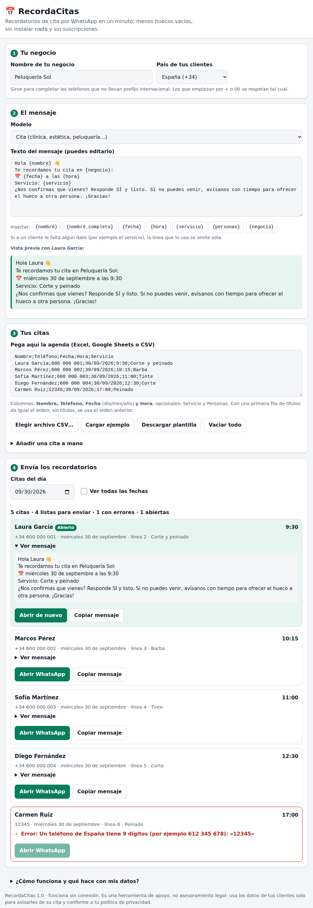

# RecordaCitas · recordatorios de cita por WhatsApp

> **ARCHIVADO · biblioteca técnica, no producto** (decisión del 29-sep-2026).
> El nicho de recordatorios de cita está saturado y se descartó como oferta comercial. El código
> y sus pruebas se conservan como **banco de pruebas y biblioteca de piezas reutilizables**
> (lectura de CSV/TSV y codificaciones, fechas, teléfonos de Uruguay, plantillas de mensaje y
> enlaces de WhatsApp). No se muestra a clientes. Sigue verificándose con `./verificar.sh`.
> Qué se reutiliza y para qué: [`../README.md`](../README.md).

Herramienta para **negocios con cita previa o reserva** (clínicas, centros de estética,
peluquerías, fisioterapia, talleres, restaurantes…). Pegas la agenda de mañana, comprueba que
cada cita y cada teléfono están bien y, con un clic por cliente, se abre tu WhatsApp con el
recordatorio ya escrito. Tú pulsas «Enviar».

Es **un solo fichero HTML** ([`recordacitas.html`](recordacitas.html)): se abre con doble clic,
funciona sin conexión, no instala nada, no tiene servidor y no guarda los datos de tus clientes.



---

## El problema

Cuando alguien no se presenta y nadie pudo reutilizar el hueco, el negocio pierde el ingreso y
la hora de trabajo. El remedio más barato y mejor estudiado es recordar la cita el día antes.

| Qué | Dato | Fuente |
|---|---|---|
| Restauración en España (medido) | Tasa media de reservas fantasma de **3,3 %** en 2025 (3,6 % en 2024) | TheFork, vía [InfoHoreca](https://www.infohoreca.com/noticias/20260708/reservas-fantasma-hosteleria) (8-jul-2026) |
| Efecto de recordar (restauración) | En 9.500 restaurantes el Día del Padre de 2025: **1,92 %** de no-shows sin protección, **1,52 %** con reconfirmación automática por SMS (−21 % relativo) y **0,66 %** con tarjeta o prepago | CoverManager, misma fuente |
| Efecto de recordar (citas sanitarias) | Los recordatorios por mensaje de texto **mejoran la asistencia** frente a no recordar (RR 1,14; IC 95 % 1,03–1,26; evidencia de calidad moderada) y **rinden igual que una llamada** (RR 0,99; IC 95 % 0,95–1,02) con menor coste. 8 ensayos aleatorizados, 6.615 participantes; en conjunto, evidencia de calidad baja a moderada | [Revisión Cochrane CD007458](https://www.cochrane.org/evidence/CD007458_mobile-phone-messaging-reminders-attendance-healthcare-appointments) (2013) |
| Clínicas y centros de bienestar en España (**estimación, no medida**) | Entre el 12 % y el 19 % de las citas quedarían sin atender y entre 2.500 y 7.500 € al mes por centro | Prensa sectorial: [El Independiente](https://www.elindependiente.com/sociedad/2025/09/29/las-ausencias-a-citas-medicas-cuestan-hasta-7-500-euros-al-mes-a-las-clinicas-privadas/) (29-sep-2025) y [Salud a Diario](https://www.saludadiario.es/vademecum/las-cancelaciones-de-ultima-hora-cuestan-a-las-clinicas-y-centros-de-bienestar-espanoles-miles-de-euros-al-ano-como-evitarlo/) (26-may-2026) |

**Cómo leer estas cifras.** La de restauración es medida por plataformas de reservas. La de
Cochrane es evidencia clínica de calidad aceptable, pero **de citas sanitarias**: no hay
ensayos equivalentes en peluquerías. Las de clínicas y centros de bienestar salen de artículos
que **no citan estudio ni metodología** (uno las atribuye de forma genérica a «estudios» y a un
proveedor de software): sirven como orden de magnitud, no como dato. Comprobadas todas el
29-sep-2026.

**Tu propio cálculo:** pérdida mensual ≈ citas al mes × % de ausencias × ticket medio. Por
ejemplo, 300 citas × 10 % × 35 € = 1.050 € al mes (cifras inventadas: pon las tuyas).

---

## Uso en un minuto

1. Abre `recordacitas.html` en tu navegador.
2. **Tu negocio:** escribe el nombre y elige el país.
3. **El mensaje:** elige un modelo (cita o reserva de restaurante) y edítalo si quieres.
4. **Tus citas:** pega la agenda copiada desde Excel o Google Sheets, elige un CSV o añade citas
   a mano. «Cargar ejemplo» y «Descargar plantilla» te enseñan el formato.
5. **Envía:** por defecto se muestran las citas de mañana. Pulsa **Abrir WhatsApp** en cada una y
   luego «Enviar» en WhatsApp. Las que ya abriste se marcan.

Nada se envía solo: cada botón abre tu WhatsApp (el móvil o WhatsApp Web) con el texto escrito.
Los teléfonos deben ser móviles con WhatsApp; para el resto, «Copiar mensaje» sirve para SMS o
correo.

---

## Qué entiende

**Columnas.** Con una primera fila de títulos da igual el orden; sin títulos se usa: *Nombre,
Teléfono, Fecha, Hora, Servicio, Personas*. Reconoce sinónimos (Cliente/Paciente, Móvil/Celular/
WhatsApp, Día, Tratamiento/Motivo, Comensales/Pax…) y una columna única «Fecha y hora».
Obligatorias: teléfono y fecha, más la hora (en su columna o dentro de la fecha).

**Fechas** (siempre día primero): `30/09/2026` · `30-9-26` · `30.09.2026` · `2026-09-30` ·
`30 sep 2026` · `30 de septiembre de 2026` · `30/09` (sin año: se supone y se avisa) · con día
de la semana delante (`mié 30/09/2026`; si no coincide con la fecha, avisa). Rechaza lo que no
existe (`31/02`) y lo ambiguo (`09/30/2026`) en lugar de adivinarlo.

**Horas:** `10:30` · `9.15` · `10h30` · `10 hs` · `5:30 pm` · `1730` · `930`.

**Teléfonos:**

| País | Se acepta | Resultado |
|---|---|---|
| España (+34) | `612 345 678`, `+34 612 345 678`, `0034612345678`, `(612) 345-678` | `34612345678`; avisa si parece un fijo |
| Uruguay (+598) | `099 123 456`, `99123456`, `+598 99 123 456` | `59899123456` |
| Otro país | Con `+` o `00` completo, o eligiendo «Otro país» y escribiendo su prefijo | se comprueba la longitud (8–15 dígitos) |

Avisa de los fallos típicos de Excel: teléfonos en notación científica (`6,12E+08`), con
decimales (`612345678.0`) o con caracteres extraños.

**Archivos:** CSV de Excel en español (Windows-1252, con `;`), UTF-8 con o sin BOM, y «Texto
Unicode» (UTF-16). Los tabuladores del pegado desde Excel se detectan solos. Un `.xlsx` se
rechaza con una explicación.

---

## El mensaje

Se escribe con datos entre llaves:

| Dato | Ejemplo |
|---|---|
| `{nombre}` | Laura (primer nombre; «GARCÍA PÉREZ, LAURA» se convierte en «Laura García Pérez») |
| `{nombre_completo}` | Laura García |
| `{fecha}` | miércoles 30 de septiembre (con el año si no es el actual) |
| `{hora}` | 10:30 |
| `{servicio}`, `{personas}` | Corte y peinado · 2 |
| `{negocio}` | Peluquería Sol |

Reglas pensadas para que **nunca salga un mensaje roto**:

- Una línea se omite **solo si faltan todos sus datos** (`Servicio: {servicio}` sin servicio).
  Si falta uno pero hay otros (`Hola {nombre}, tu cita es {fecha}`), la línea se conserva y se
  ordena el hueco: la fecha y la hora nunca desaparecen por faltar un dato secundario.
- Un dato mal escrito (`{nombr}`), unas llaves sueltas o usar `{negocio}` sin escribir el negocio
  **bloquean el envío** y lo explican.
- Se avisa (sin bloquear) si el mensaje no incluye fecha ni hora, o si un dato opcional comparte
  línea con otros.
- Los teléfonos ficticios del ejemplo no se pueden enviar, ni aunque edites el texto.

---

## Privacidad y seguridad

- **Sin red.** La página lleva una política de seguridad de contenido (`default-src 'none'`) que
  impide cargar o enviar nada fuera de sí misma. Solo se sale de ella cuando pulsas «Abrir
  WhatsApp», y lo que se abre es un enlace de `api.whatsapp.com` con el mensaje que ves.
- **No se guardan datos de clientes.** Solo se recuerdan en el navegador el nombre del negocio, el
  país, el prefijo y el texto del mensaje. La agenda se pierde al cerrar la pestaña.
- **Nombres inertes.** Lo que llega de la agenda se muestra como texto: un nombre como
  `` no ejecuta nada.
- Los enlaces se abren con `noopener noreferrer`.

Cada afirmación anterior tiene su prueba automática (ver *Verificación*).

**Por qué `api.whatsapp.com` y no `wa.me`.** `wa.me` es el formato más conocido, pero se comprobó
contra el servicio real (29-sep-2026) que su redirección sustituye los emojis y cualquier carácter
fuera de Windows-1252 por «�» (un cliente recibiría «Hola Laura �»). `api.whatsapp.com/send`, a
donde redirige `wa.me`, conserva emojis, tildes y saltos de línea.

---

## Límites conocidos

- **Probado en Chromium.** No hay Firefox ni Safari en el entorno de pruebas; el código solo usa
  funciones estándar y ampliamente soportadas, pero no se ha verificado allí.
- **El último tramo no se puede automatizar.** Se probó que el enlace es exactamente el esperado
  y que el servicio de WhatsApp lo acepta con el mensaje íntegro; que la aplicación de WhatsApp
  de cada cliente lo muestre bien depende de ella.
- **No lee las respuestas.** No sabe quién ha confirmado ni cancelado; eso se sigue viendo en
  WhatsApp. Tampoco envía en masa ni automáticamente: es a propósito, para no depender de la API
  de pago de WhatsApp ni de automatizaciones no oficiales y para que una persona vea cada mensaje.
- Solo España y Uruguay tienen reglas propias de teléfono; en otros países, prefijo o `+`.
- Es una herramienta de apoyo, **no asesoramiento legal**. Usa los datos de tus clientes solo
  para avisarles de su cita y conforme a tu política de privacidad; ante dudas, consulta a tu
  gestoría.

---

## Verificación

```bash
./verificar.sh
```

- **Núcleo y garantías (`tests/*.test.js`)**: 59 pruebas, repetidas con seis zonas horarias
  (Montevideo, Madrid, UTC, Kiritimati, Los Ángeles y Pago Pago). Incluyen pruebas de propiedades
  con miles de fechas, horas y teléfonos aleatorios, y de robustez con entradas basura.
  **No prueban una copia:** extraen el bloque `<script id="core">` del propio HTML.
- **Garantías (`tests/garantias.test.js`)**: sin API de red, CSP restrictiva, sin `innerHTML`, sin
  URLs externas salvo WhatsApp, solo ajustes del negocio en el almacenamiento, ids que existen,
  campos con etiqueta.
- **Navegador real (`tests/e2e.js`)**: 48 pasos en Chromium con Playwright: arranque sin errores,
  ninguna petición externa, «mañana» correcto a las 21:30 de Montevideo (cuando en UTC ya es el
  día siguiente), enlaces y apertura sin `opener`, XSS inerte, copiar al portapapeles, descarga
  de la plantilla, CSV en Windows-1252, móvil (320 y 375 px) y escritorio, tema oscuro,
  contraste AA, foco con teclado, 1.500 citas, almacenamiento corrupto o bloqueado. WhatsApp se
  sustituye por un simulacro: la prueba no envía ni consulta nada fuera de la máquina.

Además, durante el desarrollo se rompió el código a propósito de 25 maneras distintas (fecha UTC
en lugar de local, día y mes invertidos, no omitir líneas vacías, volver a `wa.me`…) y cada una
hizo fallar al menos una prueba.

---

## Ficheros

```
recordacitas.html     la herramienta (lógica en <script id="core">, interfaz en <script id="app">)
captura.png           imagen de este README
verificar.sh          ejecuta todas las pruebas
tests/core.test.js    núcleo: fechas, horas, teléfonos, tablas, mensajes, enlaces, propiedades
tests/garantias.test.js   privacidad y seguridad, comprobadas sobre el código
tests/e2e.js          navegador real (Playwright)
```

Para modificarla, edita el HTML y ejecuta `./verificar.sh`. Si cambias la lógica, mantenla en el
bloque `core` (sin DOM ni red) para que las pruebas la sigan ejecutando tal cual.
