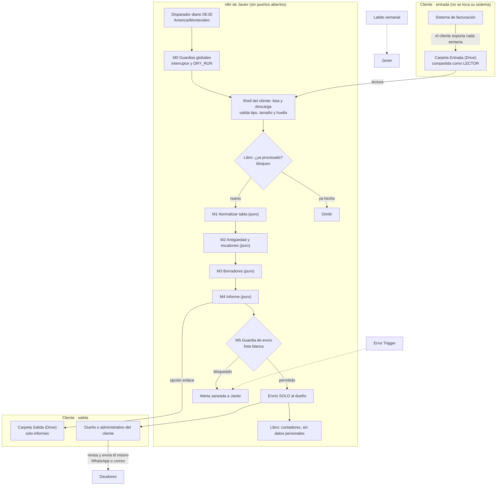

# Arquitectura modular base en n8n · Cobranza asistida

**Estado:** diseño para el Punto de control 2 · 29-sep-2026 · **actualizado el 30-sep-2026**: la **Etapa 1 está terminada**
(el núcleo puro, con sus pruebas, está en [`../nucleo/`](../nucleo/)), n8n está confirmado como tu servidor de Oracle y autorizado
como banco de pruebas (solo datos ficticios), y Oracle está en **São Paulo**. **En n8n no se ha construido, activado ni ejecutado
nada**: no se creó ningún workflow, credencial ni tabla en tu n8n y no se envió ningún correo. La Etapa 2 (armar el flujo en tu n8n)
**espera tu OK**.
**Documentos hermanos:** [plan de entrevistas](01-plan-validacion.md) · [criterios de la lista](02-criterios-lista-objetivo.md)

> No es asesoramiento jurídico. Los textos legales son los oficiales (IMPO, gub.uy) leídos el
> 29-sep-2026; lo que es interpretación mía está marcado. Las secciones 16 y 17 recogen lo que
> necesito que decidas y lo que **no** pude verificar.

---

## 1. Resumen en un minuto

- **Qué hace.** Cada día a las 08:30 (hora de Montevideo) mira si el cliente dejó su exportación de
  facturas pendientes en una carpeta compartida **solo de lectura**. Si hay un archivo nuevo, lo
  valida, calcula cuántos días lleva vencida cada factura, prepara borradores de mensaje y envía
  **un único informe al dueño o administrativo del cliente**. Ese informe lo revisa y lo envía a sus
  deudores **la propia persona**, con un clic (WhatsApp o correo).
- **Qué no hace.** No escribe en los sistemas del cliente, no escribe a los deudores, no puntúa a
  nadie, no usa inteligencia artificial, no acepta conexiones desde internet y no guarda facturas.
- **Cómo se evita lo grave.** El destinatario sale solo de una lista blanca fijada por ti; los
  ensayos van a tu bandeja; n8n no guarda los datos de las ejecuciones; los errores no llevan
  valores; ante la duda se aparta la fila y se avisa en lugar de adivinar.
- **Cómo se demuestra.** Pruebas automáticas (propiedades, mutaciones, «canarios» de privacidad,
  guardarraíles sobre el propio workflow), ensayo en una instancia de pruebas con datos ficticios,
  modo sombra con el cliente y una guía de verificación manual para no técnicos.
- **Lo que necesito de ti:** las decisiones de la [sección 16](#16-decisiones-abiertas).

---

## 2. Alcance de la v1

| En alcance (v1) | Fuera de alcance (v1) | Para más adelante, con OK nuevo |
|---|---|---|
| Leer una exportación (CSV o XLSX) de una carpeta compartida como **lector**. | Escribir en sistemas o carpetas operativas del cliente. | Envío a deudores con aprobación explícita por clic (exige recibir conexiones: túnel y refuerzo de seguridad). |
| Validar, normalizar y apartar filas dudosas. | Enviar nada a un deudor, jamás en la v1. | Conexión por API a ERPs concretos. |
| Antigüedad por tramos, en pesos uruguayos y dólares, sin mezclar monedas. | Puntuar, clasificar o predecir el comportamiento de un deudor. | Texto redactado con IA (solo con plantilla y sin datos personales, o con contrato que lo cubra). |
| Borradores por plantilla (determinista) con enlace de WhatsApp o correo. | Consultar o informar a bureaus de crédito. | Tableros y más canales. |
| Informe **solo** a direcciones de una lista blanca. | APIs de pago. | Cobro y enlaces de pago. |
| Latido, alertas saneadas y libro de registro sin datos personales. | Persistir facturas o datos de deudores en n8n. | |

**Costos.** La v1 no usa APIs de pago. Servidor, dominio y correo son costos tuyos que se recuperan en
la cuota; si más adelante se usa una API de pago, la contrata y la paga el cliente, como acordaste.

---

## 3. Principios → mecanismo → cómo se prueba

| # | Principio de tu marco | Mecanismo | Cómo se prueba |
|---|---|---|---|
| 1 | **Solo lectura** sobre el cliente | Carpeta *Entrada* compartida como **Lector** con una cuenta de servicio propia del cliente; ningún nodo de escritura o borrado sobre sus sistemas ni sobre sus carpetas operativas. Única excepción, solo en el modo `enlace_salida`: subir el informe a una carpeta *Salida* que el cliente crea para eso. | Prueba estática del workflow (ningún nodo de escritura externa salvo el envío al dueño y, si aplica, la subida a *Salida*). Prueba manual: intentar subir un archivo a la carpeta de entrada → debe fallar. |
| 2 | **Aprobación humana** siempre | El sistema solo produce texto y enlaces; los envía una persona. Los datos de contacto de los deudores nunca son destinatarios. | Prueba estática: ningún campo *To/Cc/Bcc* referencia datos del archivo. |
| 3 | **Destinatario correcto** | Lista blanca en la configuración del cliente; guardia de envío (M5); `DRY_RUN` activo por defecto y redirigido a tu bandeja; máximo 3 destinatarios. | Propiedades con destinatarios hostiles (saltos de línea, mayúsculas, dominios parecidos, listas largas); prueba de mutación. |
| 4 | **Sin fugas de datos** | n8n no guarda datos de ejecución; errores con código y sin valores; estado sin datos personales; nada de facturas en tablas. | Prueba «canario»: se inyecta un texto único en cada campo del archivo, se fuerzan fallos y se busca el canario en errores, alertas y registro. |
| 5 | **Cero riesgo para la operativa del cliente** | Sin dependencia en tiempo real de sus sistemas; nada se activa sin tu OK; etapas: pruebas → sombra → piloto. | Criterios de salida por etapa (sección 13). |
| 6 | **Estabilidad** | Idempotencia (cliente + semana ISO de la exportación + huella del archivo), bloqueo por cliente, recuperación diaria, interruptor general. | Ejecución doble y en paralelo; caída simulada a mitad. |
| 7 | **Falla cerrada** | Fecha ambigua, moneda desconocida o columna ausente → la fila se aparta con un código; si se aparta más del umbral, no se envía informe y se avisa. | Fuzz y propiedades: `aceptadas + apartadas = total` siempre. |
| 8 | **Modularidad y reutilización** | Módulos puros con contrato de datos + un *shell* por cliente. Añadir un cliente = clonar el shell y su configuración. | Pruebas de contrato por módulo. |
| 9 | **Infraestructura mínima y aislada** | Sin puertos entrantes, versión de n8n fija, 2FA, nodos peligrosos excluidos. | Lista de verificación del despliegue (sección 10.7). |
| 10 | **Trazabilidad sin datos personales** | Libro con contadores, huellas y estados. | Revisión de esquema: ninguna columna admite texto libre del archivo. |

---

## 4. Vista general



**Lectura del diagrama.**
1. El cliente exporta la lista de facturas pendientes desde su sistema y la deja en la carpeta
   *Entrada*. Nosotros solo la leemos.
2. n8n despierta cada día, consulta los guardias globales y busca un archivo nuevo.
3. Antes de tocar el contenido comprueba tipo, tamaño y huella, y consulta el libro para no repetir.
4. Los módulos puros (M1 a M4) transforman los datos en memoria; no tienen credenciales ni red.
5. La guardia M5 decide a quién se puede escribir; el resto es una alerta a ti.
6. El dueño recibe el informe y actúa. Nada llega a un deudor sin su clic.

---

## 5. Componentes

Convención de nombres: `[COB-DEV]` / `[COB-PROD]` + nombre, y etiquetas `cobranza`, `modulo` o
`cliente:<id>`. La instancia de pruebas nunca contiene datos reales.

| Workflow | Tipo | Disparador | Credenciales | Qué hace | Si falla |
|---|---|---|---|---|---|
| **Shell del cliente** (uno por cliente) | Entrada/salida | Programado, diario 08:30 `America/Montevideo` | Cuenta de servicio de Drive (solo ese cliente) y envío de correo | Orquesta: configuración, guardias, lectura, libro, módulos, envío. Es **el único** lugar con entrada/salida. | Error Trigger → alerta saneada. Nada parcial se envía. |
| **M0 Guardias y configuración** | Puro | Sub-workflow | Ninguna | Convierte la fila del interruptor general en `{permitido, dry_run}` (ante un valor raro no se procesa y se ensaya) y valida la configuración del cliente devolviendo **todos** los problemas juntos. | Falla cerrada: sin respuesta = no se procesa. |
| **M1 Normalizar tabla** | Puro | Sub-workflow | Ninguna | Filas crudas → facturas normalizadas + filas apartadas con código. | Código de error sin valores. |
| **M2 Antigüedad y escalones** | Puro | Sub-workflow | Ninguna | Días de atraso, tramos, totales por moneda, escalón sugerido. | Idem. |
| **M3 Borradores** | Puro | Sub-workflow | Ninguna | Texto por plantilla, enlaces de WhatsApp y correo. Bloquea plantillas rotas. | Idem. |
| **M4 Informe** | Puro | Sub-workflow | Ninguna | Página HTML autocontenida (informe completo) y texto de resumen solo con totales. | Idem. |
| **M5 Guardia de envío** | Puro | Sub-workflow | Ninguna | Filtra los destinatarios solicitados contra la lista blanca; aplica `DRY_RUN`. | Bloquea y alerta. |
| **M6 Registro y alertas** | Puro | Sub-workflow | Ninguna | Sanea errores (solo el código), arma la alerta, valida la fila del libro (columnas fijas), calcula la clave de idempotencia y decide qué hacer según el libro y el bloqueo. | Código de error sin valores. |
| **M7 Ingesta** | Puro | Sub-workflow | Ninguna | Elige el archivo de la carpeta (tipo, tamaño, antigüedad, el más reciente; un empate es «ambiguo»), verifica la descarga y decide el aviso semanal de «no llegó». Nunca devuelve nombres de archivo. | Idem. |
| **Alertas** | Infraestructura | Error Trigger | Correo | Convierte un error en un aviso saneado (cliente, workflow, nodo, código, id de ejecución). | — |
| **Latido** | Infraestructura | Programado semanal | Correo | Te envía «Cobranza OK». Si un lunes no llega, algo se cayó. | Lo detectas tú por ausencia. |
| **Limpieza** | Infraestructura | Programado mensual | Ninguna | Borra del libro filas de más de 13 meses. | Alerta. |

**Por qué un *shell* por cliente y no un único workflow con un bucle.** Un bucle obligaría a que las
credenciales de todos los clientes convivan en un solo workflow: un error de mapeo mezclaría datos.
Con un shell por cliente cada cual tiene **su** credencial, **su** horario, **su** interruptor y su
lista blanca. Los shells se generan desde una plantilla para no mantenerlos a mano. Los módulos
puros no tienen credenciales ni nodos de red: **no pueden filtrar datos porque no tienen por dónde
sacarlos**, y eso se comprueba con una prueba estática.

Defensa adicional: los sub-workflows pueden restringir quién los invoca (ajuste *This workflow can
be called by*). Se confirma en la versión desplegada.

---

## 6. Contratos de datos

**Configuración del cliente** (vive en el shell y la fijas tú; nada de esto se lee del archivo del cliente):

```
cliente_id            "c001"
empresa               { nombre, medios_pago?, firma? }   datos que aparecen en los mensajes
destinatarios_permitidos  ["dueno@cliente-ejemplo.example"]   lista blanca (1 a 3), en forma canónica
remitente_prueba      "tu-bandeja@…"   adonde va todo lo que se ensaya
entrega               "correo_completo" | "enlace_salida"
acepta_correo_completo  true   obligatorio si modo "real" y entrega "correo_completo"
zona_horaria          "America/Montevideo"   (debe existir: con ella se calcula la fecha local)
carpeta_entrada_id    (ID de Drive) · hoja_xlsx
patron_nombre_archivo "facturas*" (comodines * y ?) · antiguedad_maxima_archivo_dias 8 · tamano_maximo_bytes 5 000 000
dia_aviso_sin_archivo 3 (miércoles): desde ese día se avisa, una vez por semana, si no llegó la exportación
mapeo_columnas        { factura, serie?, deudor, importe, moneda?, emision?, vencimiento, telefono?, correo?, en_disputa? }
formato_importe       decimal "," · miles "."   (configurable; lo ambiguo se rechaza)
monedas_admitidas     ["UYU", "USD"] · moneda_por_defecto?
tramos                [1,30] [31,60] [61,90] [91,+]
escalones             amable 1–15 · segundo aviso 16–45 · aviso firme 46+   (cada uno necesita su plantilla)
umbral_rechazo        5 %   (0 a 100)
limites · rango_vencimiento · ignorar_filas_de_total   máximo de filas y de largo de celda; años admitidos; filas «Total»
plantillas            textos con {llaves}; por defecto: formales, en plural, sin amenazas
modo                  "dry_run" (por defecto) | "real"
```

**Factura normalizada** (salida de M1, solo en memoria):

```
factura_ref       "A-1001"        serie y número, normalizados
deudor_nombre     "…"             solo en memoria y en el informe al dueño; nunca en el libro
moneda            "UYU" | "USD"
importe_centavos  entero > 0      nada de decimales flotantes
emision, vencimiento  "AAAA-MM-DD"  fechas sin hora ni zona
contacto_tel?, contacto_mail?  opcionales, normalizados (móvil de Uruguay → 598…)
fila_origen       12              trazabilidad
```

**Fila apartada:** `{ fila: 12, codigo: "E_FECHA_AMBIGUA" }`. **El código nunca lleva el valor.**
Ejemplos: `E_FECHA_AMBIGUA`, `E_IMPORTE_INVALIDO`, `E_MONEDA_DESCONOCIDA`, `E_REF_VACIA`, `E_DUPLICADA`,
`E_COLUMNA_FALTANTE`. El catálogo completo, con qué hacer ante cada uno, está en [`../nucleo/CODIGOS.md`](../nucleo/CODIGOS.md).

**Informe:** `{ asunto, html_completo, texto_resumen }`. El resumen solo contiene totales por moneda,
tramos y número de filas apartadas.

**Entrega.** Dos modos con los mismos módulos (decisión en la sección 16):
- `correo_completo`: el informe completo va en el cuerpo del correo. Simple. Los datos de los
  deudores viajan por correo y quedan en «Enviados» del remitente; un destinatario equivocado sería
  una fuga real. **Solo con datos ficticios.**
- `enlace_salida`: el informe completo se deja como archivo en una carpeta *Salida* del cliente y el
  correo lleva **solo totales y un enlace**. Un destinatario equivocado vería totales, no personas,
  y no puede abrir el archivo sin permiso. Exige permiso de escritura **solo en esa carpeta**.

---

## 7. Reglas de negocio de la v1

- **Vencida:** `vencimiento < fecha de corte`. La fecha de corte es la fecha del día en
  `America/Montevideo` cuando arranca la ejecución; se calcula **una vez** en el shell y se pasa a
  los módulos como parámetro explícito, así que los módulos no dependen del reloj ni de la zona.
  El atraso son días de calendario, calculados en UTC sobre fechas sin hora (a prueba de horario de
  verano y de zonas, como en RecordaCitas).
- **Tramos por defecto:** 1–30, 31–60, 61–90, 91 o más. Configurables por cliente.
- **Escalón sugerido:** depende **solo de los días de atraso** (y de marcas que ponga el cliente en
  su exportación, como «en disputa», que suprimen la sugerencia). Por defecto: recordatorio amable
  (1–15), segundo aviso (16–45), aviso firme o llamada (46 o más).
- **Monedas:** solo `UYU` y `USD` en la v1. No se convierten ni se suman entre sí. Otras monedas se
  apartan.
- **Importes:** enteros en centavos. Una cifra ambigua (`1,234` puede ser 1,234 o 1.234) se aparta
  en lugar de adivinar. Notas de crédito e importes ≤ 0 se apartan con `E_IMPORTE_NO_POSITIVO`.
- **Fechas:** día primero; lo ambiguo se aparta (igual que en RecordaCitas).
- **Sin estado por factura.** Cada informe se calcula solo con la exportación de esa semana.
  «Nueva esta semana» = atraso de 7 días o menos. No hay historial de deudores.
- **Sin perfilado.** No hay puntaje, ranking de riesgo, probabilidad de impago ni historial de un
  deudor entre semanas o entre clientes. Razón legal: el
  [Decreto 64/020 art. 6](https://www.impo.com.uy/bases/decretos/64-2020) exige una evaluación de
  impacto previa cuando el tratamiento implique evaluar aspectos personales para crear o usar
  perfiles, en particular sobre **situación económica, fiabilidad de comportamiento y solvencia
  financiera**; y la [Ley 18.331 art. 22](https://www.impo.com.uy/bases/leyes/18331-2008) regula el
  tratamiento de datos de solvencia crediticia. La v1 se queda en un cálculo objetivo (días de
  atraso). **Mi lectura:** aun así conviene documentar una evaluación de impacto ligera antes de
  usar datos reales.
- **Tono de los borradores:** por defecto **formal en plural** («Estimados: les recordamos…», decisión del 30-sep;
  cada cliente puede cambiarlo). Cortés. Sin amenazas y sin mención de informes comerciales, acciones
  legales o consecuencias. Una prueba busca esas expresiones en todas las plantillas.
- **Borradores válidos o ninguno:** una plantilla con una llave sin resolver o un dato
  obligatorio vacío bloquea el borrador (como en RecordaCitas). La fecha y el importe nunca se
  omiten por faltar un dato secundario.

---

## 8. Estado mínimo, idempotencia y bloqueos

Solo se usan **tablas de datos de n8n** (integradas, sin credenciales). Ninguna contiene facturas,
nombres ni contactos.

| Tabla | Columnas | Para qué |
|---|---|---|
| `cob_ejecuciones` | `clave` (cliente + semana ISO de la exportación + huella), `cliente_id`, `semana_iso`, `hash_archivo`, `estado` (`ok`, `incidencia`, `error`, `omitida`), `iniciada_utc`, `terminada_utc`, `n_filas`, `n_vencidas`, `n_apartadas`, `codigo_error`, `modo` | Idempotencia y trazabilidad. Solo contadores; la fila se escribe **al terminar**. |
| `cob_bloqueos` | `cliente_id`, `expira_utc` | Evitar dos ejecuciones simultáneas de un mismo cliente. |
| `cob_config_global` | `interruptor`, `dry_run`, `actualizado_utc` | Apagar todo o pasar todo a ensayo con un cambio. |

Reglas:
1. **Huella y semana de la exportación.** La huella es el SHA-256 del contenido del archivo. Un archivo no se
   informa dos veces: basta una fila `ok` o `incidencia` con la misma clave (cliente + semana de la exportación +
   huella); una fila `error` no cuenta, así se reintenta.
   - La semana es la de la **exportación** (el día local en que se modificó el archivo), no la de la
     ejecución: así un archivo que sigue fresco al cruzar el lunes no genera un segundo informe. *Corregido
     durante la Etapa 1: con la semana de la ejecución y la ventana de 8 días, un mismo archivo podía
     informarse dos veces.*
   - Un archivo corregido (huella distinta) sí se procesa: es un informe nuevo, útil. Si el cliente vuelve
     a exportar la semana siguiente, aunque el contenido sea idéntico, también hay informe nuevo
     (cadencia semanal).
   - El archivo debe haberse **modificado en los últimos 8 días** (configurable): uno más antiguo se
     trata como «no llegó», para no repetir cada semana un informe con datos viejos.
2. **Bloqueo** con caducidad (por ejemplo 30 minutos). Una ejecución interrumpida se detecta porque
   su bloqueo caduca sin que exista fila en el libro: entonces se avisa y **no se reintenta solo**.
   El shell libera el bloqueo al terminar, con éxito o con error.
3. **Doble llave para el envío real.** Solo se envía al dueño si el interruptor global permite
   el modo real **y** el cliente está en `modo: "real"`. Basta que uno de los dos esté en ensayo para
   que el envío se redirija a tu bandeja (o no se haga).
4. **Marcar como hecho después de enviar.** Se sigue la pauta de n8n para disparadores por sondeo:
   se consulta el libro antes y se inserta la fila `ok` después del envío. Se acepta como costo un
   duplicado raro (el envío salió y el marcado falló) antes que perder un informe; como el único
   destinatario es el dueño, un duplicado es inocuo.
5. **Recuperación diaria.** El disparador es diario, no semanal: si el servidor estuvo caído el
   lunes, el martes lo recoge. Si el miércoles (`dia_aviso_sin_archivo`, configurable) no ha llegado
   archivo, se envía al dueño un aviso fijo «no encontramos la exportación de esta semana» (también
   solo a la lista blanca), **una sola vez por semana**: queda como fila `incidencia` con la huella de
   ceros («sin archivo») y código `E_SIN_ARCHIVO`. Un archivo ilegible se avisa igual, una vez por
   archivo (`incidencia` con el código del motivo). Si hay dos archivos aptos con el mismo instante más
   reciente no se elige ninguno: se avisa a Javier (`E_ARCHIVO_AMBIGUO`).
6. **Retención:** el libro conserva 13 meses (propuesta) y `Limpieza` borra lo anterior.
7. **Fin de contrato:** se borran el shell, la credencial, la cuenta de servicio y las filas del
   libro del cliente, y se confirma por escrito. La [Ley 18.331 art. 30](https://www.impo.com.uy/bases/leyes/18331-2008)
   impide usar los datos tratados por cuenta de un tercero para otro fin y exige **destruirlos** al
   cumplirse la prestación (salvo autorización expresa, hasta dos años). Por diseño no hay nada que
   destruir salvo el libro, que no contiene datos personales.

---

## 9. Seguridad y privacidad por diseño

### 9.1 Roles

Según la [Ley 18.331 art. 4](https://www.impo.com.uy/bases/leyes/18331-2008): **responsable** es quien
decide sobre la finalidad y el uso de la base (el cliente); **encargado** es quien trata datos «por
cuenta del responsable» (tu unipersonal). Consecuencias: contrato escrito de encargo (finalidad,
seguridad, subencargados como Oracle y Google, borrado, aviso de incidentes, derecho de auditoría),
uso solo para el fin contratado (art. 30), y aviso **inmediato** al responsable si conoces una
vulneración (Decreto 64/020 art. 4). La redacción del contrato conviene revisarla con un abogado.

### 9.2 Mapa legal → diseño

| Norma (verificada) | Qué exige | Cómo lo cumple el diseño |
|---|---|---|
| Ley 18.331 art. 10 | Seguridad y confidencialidad; prohíbe registrar datos en bases sin condiciones técnicas de integridad y seguridad. | Sección 9.3 y lista de endurecimiento (10.7). |
| Ley 18.331 art. 11 | Reserva: uso solo para las operaciones del giro; secreto profesional para quien interviene. | Cláusula de confidencialidad; sin acceso del cliente a n8n; sin difusión. |
| Ley 18.331 art. 12; Decreto 64/020 arts. 5, 8 y 9 | Responsabilidad proactiva; privacidad **por diseño y por defecto**: minimizar, seudonimizar, definir retención, planes de contingencia; documentar. | Columnas permitidas por cliente (lo demás se descarta al leer); sin estado por factura; libro sin datos personales; este documento como constancia; runbook de incidentes. |
| Ley 18.331 art. 30 | Uso solo para el fin del contrato; no ceder ni conservar; destruir al terminar. | Aislamiento por cliente; sin tablas compartidas de deudores; borrado al fin del contrato. |
| Decreto 64/020 arts. 3 y 4 | Medidas técnicas; actuar sobre incidentes en las primeras 24 horas; el responsable avisa a la URCDP en 72 horas; el encargado avisa **de inmediato** al responsable. | Runbook (9.4). |
| Decreto 64/020 art. 6 | Evaluación de impacto **previa** si hay perfilado de situación económica, o si se transfieren datos personales a Estados sin nivel adecuado (literal f). | Sin perfilado. **Con un servidor en São Paulo (Brasil, fuera de la lista) la evaluación es obligatoria antes de datos reales**, salvo que la producción vaya a una región adecuada. |
| Ley 18.331 art. 23; URCDP Res. 23/021 y 63/023 | Transferencia internacional solo a países adecuados o con garantías. | Sección 10.3. |
| Ley 18.331 arts. 6 y 29 | Toda base de datos debe inscribirse. | Consultar a la URCDP si el libro o las notas de piloto exigen inscripción; el trámite es gratuito. |
| Ley 18.331 art. 9-bis, 21 | Fuentes públicas y prospección. | Documento 02 (no se usan datos de clientes para prospectar). |

### 9.3 Modelo de amenazas

| Amenaza | Mitigación | Prueba |
|---|---|---|
| **Correo al destinatario equivocado** (gravedad máxima) | Lista blanca fijada por ti; el destinatario nunca sale del archivo; guardia M5; máximo 3; `DRY_RUN` redirige a tu bandeja; modo `enlace_salida` para datos reales. Cambios de destinatario solo por escrito desde el correo ya registrado **y** con confirmación por otro canal (evita el engaño «cambia el correo»). | Propiedades y mutaciones sobre M5; búsqueda estática de expresiones en *To/Cc/Bcc*. |
| **Inyección en cabeceras, HTML o enlaces** (nombres con saltos de línea, `<script>`, comillas; un «correo» del deudor como `x@ejemplo.example?bcc=otro@ejemplo.example` que añadiría copia oculta al abrir el enlace `mailto:`) | Los campos del archivo solo entran como texto escapado; jamás en cabeceras ni en destinatarios. El informe es HTML sin scripts; los únicos enlaces son `https://api.whatsapp.com/send` con teléfono validado (solo dígitos) y `mailto:` con correo validado con un patrón estricto (sin `?`, `&`, `,`, `;`, `%` ni espacios) y cada parte codificada. La versión en archivo autónomo añade una CSP restrictiva. | Fuzz con cargas hostiles, incluidos `mailto:` con parámetros; garantías estáticas del HTML (como RecordaCitas). |
| **Fuga por registros de n8n** | Sin datos de ejecución guardados (por workflow y a nivel de servidor); errores con código; sin PII en el libro. | Prueba del canario. |
| **Archivo malicioso o enorme** | Tipo permitido (CSV y XLSX), tamaño máximo, número máximo de filas, solo archivos de la carpeta del cliente, versión actualizada; se prefiere CSV. Las librerías que leen hojas de cálculo han tenido vulnerabilidades ante ficheros manipulados: verificar la versión desplegada. | Casos de corrupción y de exceso; límites en pruebas. |
| **Instancia de n8n vulnerable o expuesta** | Sin puertos entrantes; versión fija y actualizada; sin webhooks ni formularios públicos en la v1; 2FA; nodos de ejecución de comandos y de disco excluidos. En enero de 2026 se divulgó una vulnerabilidad crítica **sin autenticación** (CVE-2026-21858, CVSS 10.0), explotable por formularios y webhooks públicos ([The Hacker News, 7-ene-2026](https://thehackernews.com/2026/01/critical-n8n-vulnerability-cvss-100.html)); hubo otras que exigían autenticación. | Lista de despliegue; revisión de avisos de seguridad de n8n cada mes. |
| **Robo de la clave de la cuenta de servicio** | **Una cuenta de servicio por cliente**, con acceso de lector a una sola carpeta; rotación de claves; revocación al terminar. El robo de una clave expone a un cliente, no a todos. | Revisión de permisos en la guía manual. |
| **Pérdida de la clave de cifrado de n8n** | Copia de `N8N_ENCRYPTION_KEY` guardada aparte de la copia de la base de datos. Sin ella las credenciales no se descifran. | Ensayo de restauración. |
| **Ejecución duplicada** | Libro + bloqueo. | Ejecución doble y paralela. |
| **Cálculo equivocado** (zonas, moneda, decimales) | Aritmética en UTC sobre fechas sin hora; rechazo de lo ambiguo; enteros en centavos; sin conversión de monedas. | Matriz de 6 zonas horarias; propiedades; sombra. |
| **Ingeniería social sobre el cliente** | Ver cambios de destinatario arriba; sin acceso del cliente a n8n. | Runbook. |

### 9.4 Incidentes (runbook resumido)

1. **Primeras 24 horas** desde que se constata: contener (interruptor general en apagado, revocar
   credenciales afectadas) y limitar el impacto (Decreto 64/020 art. 3).
2. **De inmediato**: avisar al responsable (el cliente), porque solo él puede notificar a la URCDP
   dentro de las **72 horas** (art. 4).
3. Recoger lo mínimo necesario: fecha estimada, naturaleza, datos afectados, posibles impactos.
4. Tras resolverlo, informe detallado de la vulneración y de las medidas (art. 4).

---

## 10. Infraestructura y entrega

### 10.1 Entornos

- **Pruebas (DEV):** una instancia donde **solo** hay datos ficticios. El 30-sep confirmaste que la
  instancia conectada es tu servidor de Oracle y autorizaste usarla como banco de pruebas. Nada activo,
  todo con prefijo `[COB-DEV]`. Se usa desde la Etapa 2, con tu OK para arrancarla.
- **Producción (PROD):** instancia endurecida (10.7), sin cursos ni experimentos, con datos reales
  únicamente después de contrato, unipersonal y las decisiones de 10.2 a 10.5.

**Lo que vi de tu n8n (solo lectura, sin cambiar nada).** Tres workflows inactivos de cursos
(«Gestor de Redes Sociales», «HOLA MUNDO N8N» y «Section 1 - Academy Registration»), una credencial
(«n8n Academy API Key», de tipo cabecera HTTP) y ninguna tabla de datos. No hay credenciales de
Google. Las señales que vi (sin proyectos de equipo y sin créditos de *gateway*, el servicio gestionado
de n8n Cloud) son compatibles con una instalación propia; la confirmación de que es tu servidor de
Oracle es tuya, del 30-sep. Hasta la Etapa 2 no se crea nada en ella.

### 10.2 Oracle Cloud Always Free (documentación de Oracle, 29-sep-2026)

- Hasta **2 máquinas AMD Micro** (1/8 de OCPU con ráfaga, **1 GB de memoria**) y/o instancias Arm A1
  con **2 OCPU y 12 GB** en total; **200 GB** de almacenamiento de bloques; **10 TB** de salida al mes.
- **Recuperación de instancias inactivas:** Oracle puede reclamar una instancia si durante 7 días el
  percentil 95 de CPU es inferior al 20 %, la red es inferior al 20 % y (solo en A1) la memoria es
  inferior al 20 %. Un n8n que solo despierta una vez al día puede caer en esa definición.
- Las instancias Always Free **deben crearse en la región de origen** de la cuenta. La tuya es **São Paulo**
  (Brasil): ver las consecuencias para datos reales en 10.3.
- El puerto 25 saliente está bloqueado por defecto: el envío SMTP debe usar 465 o 587.
- La página **no menciona un acuerdo de nivel de servicio**. Oracle dice que tras pasar a *Pay As You
  Go* no cobra por los recursos Always Free; **no verifiqué** si esa mejora evita la recuperación por
  inactividad: pregúntalo a Oracle por escrito.
- **Recomendación (mía):** para datos reales, no depender solo de Always Free. Pasar a PAYG (con la
  garantía de Oracle por escrito) o un servidor de pago pequeño, con copias de seguridad fuera de la
  máquina y el latido semanal.

### 10.3 Región y transferencias internacionales

El almacenamiento en un servidor fuera de Uruguay es una **transferencia internacional** (art. 23).
La URCDP considera adecuados a los miembros de la UE y el EEE, Andorra, Argentina, el sector privado
de Canadá, Guernsey, Isla de Man, Islas Feroe, Israel, Japón, Jersey, Nueva Zelanda, el Reino Unido
y Suiza, además de las entidades sujetas a la ley surcoreana y las organizaciones del «Listado del
Marco de Privacidad de Datos» de EE. UU. ([Res. 23/021](https://www.gub.uy/unidad-reguladora-control-datos-personales/institucional/normativa/resolucion-n-23021)
y [Res. 63/023](https://www.gub.uy/unidad-reguladora-control-datos-personales/institucional/normativa/resolucion-n-63023)).
Brasil y Chile **no figuran** en esa lista. Si el servidor está en una región de un país no listado,
hacen falta las excepciones del art. 23 o garantías contractuales autorizadas por la URCDP.
La URCDP publicó una guía para redactar cláusulas
([Res. 41/021](https://www.gub.uy/unidad-reguladora-control-datos-personales/institucional/normativa/resolucion-n-41021)).
**Tu cuenta de Oracle está en São Paulo (dato del 30-sep).** Brasil **no figura** en la lista de la URCDP,
así que, para datos personales reales, alojar allí es una transferencia a un Estado sin nivel adecuado.
Consecuencias:

- **Con datos ficticios no hay problema**: Oracle en São Paulo sirve como banco de pruebas.
- **Con datos reales** hace falta una excepción del art. 23 o la autorización de la URCDP con garantías
  contractuales, y la evaluación de impacto pasa a ser **obligatoria antes de empezar** (Decreto 64/020
  art. 6, literal f). Cuenta la transmisión, no solo el almacenamiento: tratar los datos en memoria en
  un servidor de São Paulo también es transferirlos ([Res. 23/021](https://www.gub.uy/unidad-reguladora-control-datos-personales/institucional/normativa/resolucion-n-23021),
  considerando I).
- El art. 23 permite transferir con el consentimiento inequívoco del titular o cuando sea necesario para
  ejecutar un contrato con el titular. Aquí los titulares son los **deudores** del cliente: no es
  práctico recabar su consentimiento y el segundo caso es una lectura forzada. **No lo daría por bueno
  sin un abogado.**

Opciones para producción, a decidir **antes de la Etapa 3** (D6):

1. **Servidor de producción en una región adecuada** (UE, Reino Unido, etc.). **No verifiqué** si Oracle
   permite crear servidores de pago en otras regiones desde tu cuenta, si la región de origen puede
   cambiarse, ni sus condiciones para abrir otra cuenta.
2. **Pedir a la URCDP la autorización** para transferir a Brasil con cláusulas contractuales (guía de la
   [Res. 41/021](https://www.gub.uy/unidad-reguladora-control-datos-personales/institucional/normativa/resolucion-n-41021)).
   Plazo y costo: desconocidos.
3. **Variante local** (sección 12): los datos de los deudores no salen del cliente.
4. **Otro proveedor** con región adecuada.

La lista de la URCDP puede haber cambiado desde la Res. 63/023 (nov-2023): compruébalo en su sitio antes de
decidir.

### 10.4 Entrada de datos (elige una)

| Opción | Cómo funciona | A favor | En contra |
|---|---|---|---|
| **A · Carpeta de Drive con cuenta de servicio (recomendada)** | El cliente comparte la carpeta *Entrada* como **Lector** con la cuenta de servicio de **su** cliente. n8n la consulta. | Solo lectura garantizada por el cliente (él la concede y la revoca); no caduca cada 7 días; sin ventana de OAuth; el nodo de Drive admite cuentas de servicio ([doc de n8n](https://docs.n8n.io/integrations/builtin/credentials/google/)). | Exige que el cliente use Google Drive; una cuenta de servicio y una clave por cliente. |
| **B · Buzón dedicado (IMAP)** | El cliente reenvía la exportación a un buzón nuestro; n8n la lee. | Funciona con cualquier cliente y sin Drive. | El archivo viaja por correo y queda en un buzón que hay que purgar; requiere un buzón profesional y dominio propio. |
| **C · Carga manual (solo piloto)** | La subes tú al recibirla. | Cero infraestructura para arrancar. | No es un servicio; depende de ti. |

Si el cliente usa Microsoft 365, la opción A se reemplaza por OneDrive o SharePoint con permisos
equivalentes (por diseñar).

### 10.5 Correo saliente (elige uno)

| Opción | Estado |
|---|---|
| **Gmail personal con OAuth2** | Válido **solo con datos ficticios**. Si la aplicación de Google Cloud está en modo «Testing», el token de refresco caduca a los **7 días** ([Google](https://developers.google.com/identity/protocols/oauth2)); con permisos de Gmail el token también deja de funcionar si cambias la contraseña. Los envíos por Gmail API quedan en «Enviados». n8n recomienda OAuth2 para el nodo de Gmail; las cuentas de servicio exigen delegación de dominio, que Google desaconseja. |
| **SMTP con contraseña de aplicación** | Requiere verificación en dos pasos y Google no recomienda las contraseñas de aplicación ([Google](https://support.google.com/accounts/answer/185833)). Alternativa provisional. |
| **Dominio propio + buzón profesional (recomendada)** | Con SPF, DKIM y DMARC. Necesario antes de datos reales y para tu firma comercial. Elegir un proveedor que ofrezca condiciones de encargado de tratamiento. |
| **Proveedor transaccional** | Sobre dominio propio; buena entregabilidad; revisar términos y ubicación. |

El límite de Gmail personal es de 500 envíos al día ([Google](https://support.google.com/mail/answer/22839)),
irrelevante aquí: el problema de reputación viene de no tener dominio propio, no del volumen.

### 10.6 Acceso al editor de n8n

Sin exposición pública. Acceso por túnel SSH o VPN. Para crear credenciales OAuth basta con el
editor a través del túnel local. Si más adelante se instala Cloudflare Tunnel, con autenticación
(Access) por delante y **sin** publicar webhooks ni formularios en la v1.

### 10.7 Lista de endurecimiento del despliegue (PROD)

- [ ] Versión de n8n **fija** (no `latest`), actualizada tras leer los avisos de seguridad.
- [ ] Sin puertos entrantes salvo SSH (restringido a tu IP si es posible).
- [ ] `N8N_BLOCK_ENV_ACCESS_IN_NODE=true`. *(El `docker-compose.yml` de ChollosBot en este repo lo
      pone en `false`, y usa `latest`: sirve para ese proyecto, **no** debe copiarse para datos de
      clientes.)*
- [ ] `EXECUTIONS_DATA_SAVE_ON_SUCCESS=none` y `EXECUTIONS_DATA_SAVE_ON_ERROR=none`
      ([doc de n8n](https://docs.n8n.io/hosting/configuration/environment-variables/executions/); el valor por
      defecto de ambas es `all`), más el mismo ajuste en cada workflow y `EXECUTIONS_DATA_PRUNE` con
      `EXECUTIONS_DATA_MAX_AGE` corto.
      *Costo aceptado:* un fallo real no deja datos para depurar; se reproduce con datos ficticios en DEV
      guiándose por el código de error y el número de fila.
- [ ] Modo de datos binarios que no deje archivos en disco tras la ejecución (a confirmar en tu versión).
- [ ] Nodos que ejecutan comandos o leen y escriben disco excluidos, y paquetes de la comunidad
      desactivados (nombres de las variables por confirmar en la documentación de tu versión).
- [ ] Sin módulos externos en el nodo de código (`NODE_FUNCTION_ALLOW_EXTERNAL` vacío).
- [ ] 2FA en la cuenta del propietario.
- [ ] Copias de seguridad cifradas **fuera** de la máquina, y la clave `N8N_ENCRYPTION_KEY` guardada aparte.
- [ ] Telemetría desactivada (`N8N_DIAGNOSTICS_ENABLED=false`).
- [ ] Latido semanal funcionando y probado.

### 10.8 Licencia de n8n

La [licencia de uso sostenible](https://docs.n8n.io/n8n-community-license/community-license/license-faq)
permite prestar servicios de consultoría y automatización a clientes en tu propia instancia siempre
que los clientes no accedan directamente a ella: reciben resultados, no acceso. Aquí el cliente
recibe un informe y nada más. No se hospeda n8n como servicio ni se deja que un cliente cree o edite
workflows. Si el esquema cambia, consulta a `license@n8n.io`.

---

## 11. Estrategia de pruebas

Se sigue el método de RecordaCitas, que encontró fallos reales (una plantilla que borraba la fecha y
la hora si faltaba el nombre, `wa.me` corrompiendo emojis, teléfonos mal leídos) y detectó las 25
roturas provocadas a propósito.

**Fuente de verdad.** Cada módulo puro es un archivo JavaScript del repositorio, sin dependencias
de n8n. Un generador lo inserta en el nodo de código del workflow y una **prueba de deriva** verifica
que el código dentro del workflow es idéntico al del archivo: se prueba lo que se ejecuta.

| Nivel | Qué cubre |
|---|---|
| **1 · Unitarias** | Casos concretos por módulo, con ejemplos de exportaciones reales anonimizadas y sintéticas de sistemas distintos. |
| **2 · Propiedades y fuzz** | Miles de archivos aleatorios: separadores, codificaciones, decimales, fechas, espacios, duplicados, importes negativos o cero, columnas ausentes. Invariantes: `aceptadas + apartadas = total`; suma de tramos por moneda = total vencido; ninguna factura duplicada; atraso ≥ 1 en toda vencida; mismo archivo → mismo resultado. |
| **3 · Matriz de zonas horarias** | Todo lo anterior con seis zonas (Montevideo, Madrid, UTC, Kiritimati, Los Ángeles, Pago Pago). |
| **4 · Canarios de privacidad** | Texto único en cada campo; fallos forzados; el canario **no** puede aparecer en errores, alertas ni libro. |
| **5 · Mutación** | Se rompe el código a propósito de al menos 25 maneras (destinatario sin filtrar, fecha invertida, moneda mezclada, decimal mal leído, línea omitida…) y cada una debe hacer fallar al menos una prueba. |
| **6 · Guardarraíles estáticos sobre el workflow** | Módulos puros sin credenciales ni nodos de red; ningún disparador entrante; ningún nodo de envío sin pasar por M5; *To/Cc/Bcc* sin expresiones del archivo; ajustes de no guardar ejecuciones; `DRY_RUN` por defecto; sin nodos de comandos; datos de ejemplo solo ficticios. |
| **7 · Integración en n8n de pruebas** | El shell y los sub-workflows con archivos ficticios y envío a tu bandeja. Inyección de fallos: carpeta sin permiso, archivo corrupto o vacío, enorme, ejecución doble y paralela, correo caído, credencial caducada, interruptor apagado, día sin archivo. |
| **8 · Sombra con datos reales** | Solo tras contrato y unipersonal. Informe enmascarado a ti, real solo al dueño tras semanas de coincidencia con su cálculo. |
| **9 · Guía de verificación manual** | Para ti, sin conocimientos técnicos: pasos numerados con resultado esperado, y los casos «malos» que deben rechazarse. Se entrega en el Punto de control 3. |

**Criterios de salida de la etapa de desarrollo:** 0 fallos en los niveles 1 a 7; todas las
mutaciones detectadas; canarios sin rastro; guía manual ejecutada por ti con éxito.

**Estado de la Etapa 1 (30-sep-2026).** Hechos los niveles 1 a 5 sobre el núcleo y, del nivel 6, lo que se
puede comprobar sin n8n (código puro sin red ni credenciales, `DRY_RUN` por defecto, datos de ejemplo solo
ficticios, catálogo de códigos al día). Resultado: más de 350 pruebas verdes en seis zonas horarias; canarios de
privacidad; 102 mutaciones, todas detectadas salvo dos toleradas con su razón escrita; un simulador del
flujo diario con más de 40 escenarios (doble ejecución, caídas, correo caído, descarga cortada…); y el informe
de demostración comprobado en Chromium. Los niveles 1 y 2 usan datos **sintéticos** (no había exportaciones
reales que anonimizar). Falta lo que solo puede probarse en n8n —nivel 6 sobre el workflow y nivel 7— y la guía
manual (nivel 9). Todo se repite con [`nucleo/verificar.sh`](../nucleo/verificar.sh).

---

## 12. Variante «los datos no salen de la empresa» (modo local)

Si en las entrevistas la hipótesis H5 falla (no quieren compartir la exportación), antes de pasar al
nicho 3 hay una alternativa dentro del mismo problema:

- Una **página HTML de un solo archivo**, como RecordaCitas, que el cliente abre en su ordenador:
  carga su exportación, calcula la antigüedad y prepara los borradores con enlaces de WhatsApp.
  **Nada sale de su ordenador**: tú no tratas datos de sus deudores, así que desaparecen la fuga
  posible, la transferencia internacional y el encargo de tratamiento sobre esos datos (queda solo el
  contacto del dueño para el recordatorio), y no hay infraestructura que mantener.
- n8n solo enviaría un recordatorio sin datos («Toca revisar la cobranza de la semana»).
- **A favor:** elimina de raíz la fuga, la transferencia internacional y el contrato de encargo;
  se construye con piezas ya probadas.
- **En contra:** no hay automatismo (hay que abrir la página cada semana), el valor recurrente es
  menor y el modelo de negocio cambia (implantación y soporte, no un servicio continuo).

Con el servidor en São Paulo (10.3), esta variante gana peso: es la única que no exige resolver la
transferencia a un Estado sin nivel adecuado para los datos de los deudores. También sirve como
**demostración** en las entrevistas con datos ficticios. No se construye hasta que lo decidas.

---

## 13. Etapas y puntos de control

| Etapa | Qué se hace | Requiere de ti | Sale cuando |
|---|---|---|---|
| **0 · Diseño** | Este documento, el plan de entrevistas y los criterios de la lista. | **Punto de control 2**: revisado el 30-sep-2026 con ajustes (15 entrevistas; Oracle en São Paulo). | Hecho, con las decisiones abiertas de la sección 16. |
| **1 · Núcleo puro** | Módulos M0 a M7 y su cableado en JavaScript, generador de datos ficticios, simulador del flujo diario, pruebas de los niveles 1 a 6, informe HTML de ejemplo. Todo local en el repositorio: sin n8n, sin datos reales, sin contactar a nadie. | **Terminada el 30-sep** ([`../nucleo/`](../nucleo/)). Corre **en paralelo** a las entrevistas y da una demostración realista (`nucleo/demo/`). | Hecho: criterios de salida de la sección 11 cumplidos para el núcleo. |
| **2 · n8n de pruebas** | Shell y sub-workflows en tu instancia de Oracle (São Paulo) como banco de pruebas, datos ficticios, envío solo a tu bandeja; nivel 7. | Instancia autorizada el 30-sep; **pediré tu OK para arrancar la etapa** al terminar la 1. Credenciales creadas por ti. | Nada activo salvo tus ensayos; **Punto de control 3** con guía manual. |
| **3 · Sombra** | Datos reales de un cliente que confirmó interés, con informe enmascarado. | Cliente que confirma interés real · **unipersonal en BPS/DGI** antes de tocar sus sistemas o facturar · contrato de encargo · inscripción de la base · **región y transferencias resueltas (São Paulo no vale sin más)** · evaluación de impacto documentada. | El informe coincide con el cálculo manual del cliente varias semanas seguidas. |
| **4 · Piloto** | Informe real al dueño, en modo `enlace_salida`. | **Punto de control 4** («antes del envío final»): tu autorización expresa. | Un ciclo completo sin incidentes. |

---

## 14. Reutilización de la biblioteca técnica (RecordaCitas)

Fuente: [`biblioteca-tecnica/recordacitas`](../../biblioteca-tecnica/recordacitas/) (archivada como
biblioteca, no como producto).

| Pieza probada | Para qué se reutiliza | Qué hay que añadir |
|---|---|---|
| Lectura de CSV y TSV con detección de separador | Ingesta de exportaciones | Comillas con saltos de línea y XLSX (lo lee el nodo de n8n) |
| Decodificación Windows-1252, UTF-16 y BOM | Exportaciones de sistemas en Windows | — |
| Fechas día-primero, rechazo de lo ambiguo, aritmética en UTC | Emisión, vencimiento y días de atraso | Cálculo de atraso |
| Teléfonos de Uruguay | Enlace de WhatsApp del deudor | — |
| Plantillas con omisión de líneas vacías y bloqueo de llaves rotas | Borradores | Datos de factura |
| Enlace `api.whatsapp.com/send` (no `wa.me`, que corrompe emojis) | Botón «Abrir WhatsApp» del informe | — |
| CSP restrictiva, texto inerte, sin `innerHTML` | Informe HTML autocontenido | — |
| Método de pruebas: propiedades, zonas horarias, mutaciones, garantías estáticas, navegador real | Igual | Canarios, guardarraíles sobre workflows |
| **No existe todavía** | — | Importes con formato uruguayo y monedas, referencias de factura, notas de crédito, tramos de antigüedad, agregados por moneda, guardia de envío, libro |

---

## 15. Registro de riesgos

Gravedad de 1 a 5 (5 = fuga de datos, correo a quien no corresponde o parada en producción del cliente).

| ID | Riesgo | Grav. | Prob. | Mitigación | Estado |
|---|---|---|---|---|---|
| R1 | Correo a un destinatario equivocado | 5 | Baja | Lista blanca, M5, `DRY_RUN`, `enlace_salida`, cambios con doble canal | Diseñado |
| R2 | Fuga por registros o ejecuciones de n8n | 5 | Media | Sin datos de ejecución, canarios, errores con código | Diseñado |
| R3 | Instancia de n8n vulnerable o expuesta | 5 | Media | Sin puertos, versión fija y actualizada, sin webhooks, 2FA | Diseñado |
| R4 | Transferencia internacional sin base: Oracle en São Paulo (Brasil, fuera de la lista de la URCDP) | 4 | **Alta** con datos reales | Solo datos ficticios en São Paulo; producción en región adecuada, autorización de la URCDP o variante local | **Abierto** |
| R5 | Evaluación de impacto obligatoria (transferencia a Estado no adecuado; perfilado) | 3 | **Alta** con São Paulo | Sin puntaje ni historial; evaluación documentada antes de datos reales | **Abierto** |
| R6 | Datos de un cliente usados para otro fin | 5 | Baja | Aislamiento por cliente; art. 30; borrado | Diseñado |
| R7 | Archivo malicioso, corrupto o enorme | 3 | Media | Límites, cuarentena, actualizar | Diseñado |
| R8 | Cálculo equivocado (zona, moneda, decimal) | 4 | Media | UTC, rechazo de ambiguos, sombra | Diseñado |
| R9 | Ejecución duplicada o informe que no llega | 3 | Media | Libro, bloqueo, recuperación diaria, latido | Diseñado |
| R10 | Oracle reclama la instancia o no hay SLA | 4 | Media | PAYG o servidor de pago, copias fuera, latido | **Abierto** |
| R11 | Caducidad de credenciales de Google | 3 | Alta con «Testing» | Cuenta de servicio para Drive; dominio y buzón propios | **Abierto** |
| R12 | Reputación del remitente (Gmail sin dominio) | 3 | Media | Dominio con SPF, DKIM y DMARC antes de datos reales | **Abierto** |
| R13 | Cambio de formato en la exportación del cliente | 2 | Alta | Mapeo por cliente, falla cerrada, aviso al dueño | Diseñado |
| R14 | Incidente sin protocolo claro (24 h / 72 h) | 4 | Baja | Runbook 9.4 y cláusula contractual | Diseñado |
| R15 | Incumplir la licencia de n8n | 3 | Baja | El cliente nunca accede a n8n | Diseñado |
| R16 | Punto único de fallo (una sola persona) | 3 | Media | Runbook documentado, credenciales guardadas, latido | Parcial |
| R17 | Registro de bases de datos pendiente | 3 | Media | Consulta a la URCDP antes de guardar datos | **Abierto** |

---

## 16. Decisiones abiertas

Necesito tu decisión en estos puntos; **hasta entonces no toco nada**.

| # | Decisión | Opciones | Mi recomendación | Estado (30-sep) |
|---|---|---|---|---|
| D1 | ¿La instancia de n8n conectada es tu servidor de Oracle? ¿Puedo usarla como **banco de pruebas** con datos ficticios, prefijo `[COB-DEV]` y nada activo? | Sí / No / Otra instancia | Usarla solo como pruebas; PROD separada. | **Respondida: sí, es tu servidor de Oracle (30-sep).** Autorizada como banco de pruebas. |
| D2 | Alcance inmediato | (a) Solo diseño; (b) empezar la Etapa 1 (núcleo puro, local, sin contactar a nadie) en paralelo a las entrevistas | (b) | **Respondida: (b). Etapa 1 hecha (30-sep).** La Etapa 2 espera tu OK. |
| D3 | Canal de entrada | A · Drive con cuenta de servicio · B · buzón · C · manual | A; C para el primer piloto. | Abierta (no bloquea la Etapa 1). |
| D4 | Modo de entrega con datos reales | `correo_completo` · `enlace_salida` | `enlace_salida` (un destinatario equivocado solo vería totales). | Abierta (no bloquea la Etapa 1). |
| D5 | Remitente | Gmail personal (solo ficticios) · dominio propio con buzón profesional | Dominio propio antes de datos reales. | Abierta. |
| D6 | Hosting de producción y región | Oracle Always Free · Oracle PAYG · servidor de pago; región de país adecuado | Ver sección 10.3. | **Región respondida: São Paulo.** Falta decidir el hosting de producción (antes de la Etapa 3). |
| D7 | Consultas oficiales | Preguntar a la URCDP por la inscripción de la lista de prospectos, las notas y el libro; a la URSEC por el registro «No llame» | Hacerlo antes de guardar la primera lista real. | Abierta. Puedo redactar los borradores de consulta para que los envíes tú. |
| D8 | Revisión de un abogado o contador local (una hora) | Sí / No | Sí, antes del primer contacto real: contrato de encargo, transferencia a Brasil y consulta sobre correo comercial. | Abierta. |
| D9 | Variante local (sección 12) como demostración y alternativa | Sí / No / Después de las entrevistas | Después de las entrevistas. | Abierta. |

---

## 17. Fuentes y lo que no se verificó

**Leído en su fuente el 29-sep-2026:**
[Ley 18.331](https://www.impo.com.uy/bases/leyes/18331-2008) (arts. 2, 4, 5, 6, 9, 9-bis, 10, 11, 12, 13, 17, 18, 21, 22, 23, 29, 30) ·
[Decreto 64/020](https://www.impo.com.uy/bases/decretos/64-2020) (arts. 1 a 9) ·
[Decreto 54/992 art. 8](https://www.impo.com.uy/bases/decretos/54-1992) (redacción del [504/007](https://www.impo.com.uy/bases/decretos/504-2007)) ·
[Ley 19.996 art. 181](https://www.impo.com.uy/bases/leyes/19996-2021) y [Decreto 132/022](https://www.impo.com.uy/bases/decretos/132-2022) ·
URCDP: [Res. 23/021](https://www.gub.uy/unidad-reguladora-control-datos-personales/institucional/normativa/resolucion-n-23021), [Res. 63/023](https://www.gub.uy/unidad-reguladora-control-datos-personales/institucional/normativa/resolucion-n-63023), [cambios de régimen](https://www.gub.uy/unidad-reguladora-control-datos-personales/comunicacion/noticias/cambios-regimen-transferencias-internacionales-datos-uruguay), [inscripción de bases](https://www.gub.uy/tramites/inscripcion-bases-datos-personales) ·
[Oracle, recursos Always Free](https://docs.oracle.com/en-us/iaas/Content/FreeTier/freetier_topic-Always_Free_Resources.htm) ·
[n8n: licencia](https://docs.n8n.io/n8n-community-license/community-license/license-faq), [variables de ejecuciones](https://docs.n8n.io/hosting/configuration/environment-variables/executions/), [credenciales de Google](https://docs.n8n.io/integrations/builtin/credentials/google/) ·
[Google OAuth 2.0](https://developers.google.com/identity/protocols/oauth2) ·
[The Hacker News sobre CVE-2026-21858](https://thehackernews.com/2026/01/critical-n8n-vulnerability-cvss-100.html).

**No verificado o dependiente de la versión:**
- Si pasar a *Pay As You Go* evita la recuperación de instancias inactivas de Oracle.
- Si Oracle permite cambiar la región de origen, crear servidores de pago en otras regiones o abrir otra cuenta
  en una región adecuada, y bajo qué condiciones.
- Que el listado de la URCDP no haya cambiado después de la Res. 63/023 (la página de la URCDP lista además una
  Res. 8/026 de abril de 2026 sobre cláusulas modelo del Consejo de Europa; **no leí su texto**).
- Que el proveedor de nube y el de correo figuren en el listado del Marco de Privacidad de Datos de EE. UU.
- El nombre exacto de las variables para excluir nodos y desactivar paquetes de la comunidad, el
  modo de datos binarios y el ajuste de restricción de invocaciones entre workflows, en tu versión de n8n.
- Que el SDK/MCP de n8n permita fijar los ajustes de workflow (no guardar ejecuciones, quién puede invocarlo).
- Que Google permita redirecciones `http://localhost` para el cliente OAuth creado con túnel SSH.
- Si el registro «No llame» exige inscribirse en la URSEC a una persona sin unipersonal, y si pedir una entrevista cuenta
  como ofrecer un servicio (mi lectura es que sí, por prudencia).
- La evaluación de impacto ligera, el contrato de encargo y la consulta sobre correo comercial en Uruguay
  necesitan a un profesional local.
- Solo hay un cálculo del período de pago de empresas en España; para Uruguay no hay dato verificable.
