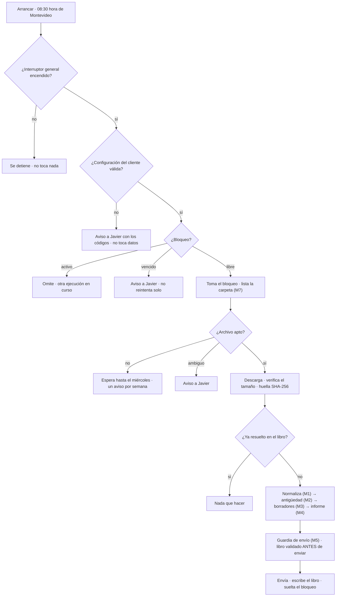

# Núcleo de cobranza asistida · Etapa 1

**Estado (30-sep-2026): Etapa 1 terminada.** Es el código que decide todo lo importante del servicio, escrito como
funciones **puras** y probado por completo **antes** de construir nada en n8n. No hay n8n, ni red, ni datos reales, ni
correos: solo JavaScript, datos inventados y pruebas. La Etapa 2 (armar el flujo en tu servidor de Oracle como banco de
pruebas) **espera tu OK**.

## Qué es y qué no es

- **Es** el cerebro del servicio: lee la exportación de facturas de un cliente, aparta lo dudoso con un código, calcula la
  antigüedad de cada factura vencida, redacta borradores de mensaje, arma un informe y decide **a quién se puede escribir**.
- **No es** un flujo de n8n. El flujo (el *shell*) solo hará entrada y salida —leer la carpeta, leer y escribir tablas,
  enviar el correo— y en cada paso llamará a estas funciones. Por eso `pipeline.js` es el plano del flujo, ya ejecutable y
  probado.
- **No** envía nada a nadie, **no** escribe en los sistemas del cliente y **no** guarda datos personales.

## Cómo verificar (segundos, sin red)

```bash
./verificar.sh                 # sintaxis, ejemplos al día, todas las pruebas en 6 zonas horarias, informe en Chromium
./verificar.sh --profundo      # además, 10 veces más casos al azar
./verificar.sh --mutaciones    # además, las pruebas de mutación (varios minutos)
./verificar.sh --todo
```

Requiere `node` 20 o superior. La prueba de navegador se omite si no hay Playwright. Una sola prueba o una sola
mutación: `node --test tests/m5.test.js` · `node mutaciones.js M5`.

## Mapa de módulos

Cada módulo es **un archivo autocontenido** que solo depende de `util.js`: se pega `util.js` + el módulo en un nodo de
código de n8n y funciona (una prueba lo comprueba cargando cada uno por separado).

| Archivo | Módulo | Qué hace |
|---|---|---|
| `src/util.js` | Util | Fechas en UTC y semana ISO, importes en **centavos enteros**, teléfonos y correos estrictos, escape de HTML, códigos de error. |
| `src/m0-guardias.js` | M0 | Interruptor general y ensayo (el valor por defecto es el lado seguro) y validación de la configuración del cliente: devuelve **todos** los problemas juntos. |
| `src/m1-normalizar.js` | M1 | Exportación (CSV o filas de una hoja) → facturas normalizadas + filas apartadas **con código**. Columnas por configuración, nunca por parecido. |
| `src/m2-antiguedad.js` | M2 | Días de atraso, tramos, escalón sugerido y totales **por moneda** (nunca se mezclan). |
| `src/m3-borradores.js` | M3 | Plantillas fijas (formal, en plural, sin amenazas) → un borrador por factura y enlaces que **abren** WhatsApp o el correo de quien revisa. |
| `src/m4-informe.js` | M4 | Informe HTML autocontenido (sin scripts ni red), resumen **sin datos personales** para el correo y avisos con texto fijo. |
| `src/m5-guardia-envio.js` | M5 | **La única fuente de destinatarios.** Lista blanca, llave doble, sin Cc ni Bcc. |
| `src/m6-registro.js` | M6 | Saneador de errores (solo códigos), alerta, fila del libro con columnas fijas, clave de idempotencia y decisión de bloqueo. |
| `src/m7-ingesta.js` | M7 | Qué archivo se procesa (tipo, tamaño, antigüedad, el más reciente) y cuándo avisar de que «no llegó». Nunca devuelve nombres de archivo. |
| `src/pipeline.js` | Cobranza | El cableado: validar la configuración, arrancar, preparar, armar el envío, alertar. Es el orden que seguirá el flujo. |

Los códigos de error y de aviso están en **[`CODIGOS.md`](CODIGOS.md)**; una prueba exige que el catálogo coincida con el código.

## El orden de una ejecución diaria



Si algo falla en cualquier punto: alerta a Javier **solo con códigos** (M6), fila `error` en el libro y bloqueo liberado.

## Garantías y cómo se comprueban

| Garantía | Cómo se comprueba |
|---|---|
| Solo se escribe a direcciones de la lista blanca; una dirección dudosa bloquea todo el envío. | `m5.test.js` (destinatarios hostiles: saltos de línea, `Bcc:`, listas con coma, homoglifos, `%0d%0a`…), propiedad sobre miles de casos, invariantes de `e2e.test.js`, mutaciones `M5-*` y `P-*`. |
| Nadie recibe nada real sin **dos llaves**: «sin ensayo» general **y** cliente en modo real. Cualquier valor raro deja el ensayo. | `m0`, `m5`, `pipeline` y la matriz completa de `e2e.test.js`. |
| Ningún dato del cliente aparece en errores, alertas, libro, bloqueos ni registros. | Pruebas con **canarios** (`m6`, `pipeline`, `e2e`, `propiedades`): un texto único en cada campo que no puede aparecer en ningún sitio. |
| En modo `enlace_salida` el correo lleva solo totales y un enlace. | Canario por cada nombre, factura, correo y teléfono en `e2e.test.js`. |
| La fecha de corte y la semana son las **locales del cliente**, no las del servidor. | Seis zonas horarias en `verificar.sh`; reloj y azar **prohibidos** en el entorno de prueba; cierre de fecha alrededor de medianoche. |
| Los importes son exactos y las monedas no se mezclan. | Oráculo independiente (`propiedades.test.js`): totales, tramos y escalones recalculados aparte sobre cientos de archivos en 4 formatos. |
| Lo dudoso se aparta, no se adivina; `aceptadas + apartadas = total`. | `m1.test.js`, fuzz con archivos estropeados de mil maneras, filas hostiles. |
| El mismo archivo no se procesa dos veces; una caída no duplica ni pierde el informe. | Escenarios de `e2e.test.js`: doble ejecución intercalada, caída antes y después de enviar, correo caído, descarga cortada. |
| El informe es inerte: sin scripts, sin red, todo texto del archivo escapado. | `m4.test.js` (lista de etiquetas permitidas), `navegador.js` (Chromium real, sin JavaScript, datos hostiles, contraste, móvil). |
| El código es puro y no esconde nada. | Cargador de pruebas sin `require`, red, archivos, reloj ni azar; `guardarrailes.test.js` (sin caracteres invisibles «Trojan Source», solo códigos literales, sin `throw` con texto libre, catálogo al día, sin credenciales). |
| Las pruebas detectan las averías. | `mutaciones.js`: se rompe una regla a propósito, de a una, y alguna prueba tiene que fallar. |

## Datos ficticios y demostración

- `datos-ficticios/generador.js` crea facturas inventadas de forma **determinista** (misma semilla, mismos datos) en cuatro
  formatos de exportación distintos, más filas hostiles para las pruebas. Todo es inventado: empresas «Ficticia», correos
  en el dominio reservado `.example` y solo los teléfonos de ejemplo `099 000 001` a `099 000 010`.
- `demo/informe-demo.html`: el informe tal como lo vería el dueño, en modo **EJEMPLO** (sin enlaces). `demo/correo-demo.txt`:
  el correo que lo acompaña. `datos-ficticios/ejemplos/`: una exportación de cada formato simulado.
- Se regeneran con `node demo/generar-demo.js` y una prueba (`demo.test.js`) exige que lo publicado coincida con el código.

## Formatos y límites conocidos

Lo que hoy **no** hace, a propósito o por no haber datos reales:

1. **Nunca se probó con una exportación real.** Los cuatro formatos simulados son razonables, no verificados contra un
   sistema de facturación concreto: el mapeo de columnas es configuración por cliente y el primer piloto necesitará una
   exportación real (anonimizada) para ajustarlo.
2. Solo **UYU y USD**, sin conversión ni mezcla. Sin intereses, recargos ni ajustes: los importes son los del archivo.
3. Fechas entre **2000 y 2099**. Un instante con hora y desfase exige que la zona horaria esté configurada.
4. Se asume texto **UTF-8**. Si el cliente exporta en otra codificación, las tildes pueden verse mal en los nombres (los importes
   y las fechas no se ven afectados).
5. **Hojas nativas de Google Sheets** no se leen: se exporta a CSV o XLSX. El XLSX tiene un tope de tamaño menor (2 MB) por ser
   un archivo comprimido; se prefiere CSV.
6. El simulador (`tests/simulador.js`) es un **modelo** del flujo, no el flujo: lo que dependa de n8n (el entorno de los nodos de
   código, las tablas de datos, el nodo de Drive, el envío por Gmail) se prueba recién en la Etapa 2.
7. Un duplicado del informe es posible si el servidor cae **entre enviar y registrar** (sale al mismo buzón del dueño; el bloqueo
   impide que ocurra solo, hace falta limpiarlo a mano). Es un costo aceptado y documentado en el documento 03, sección 8.

## Cómo pasa a n8n (Etapa 2, con tu OK)

1. Un generador inserta `util.js` + cada módulo en su nodo de código, y una **prueba de deriva** comprueba que el código del
   flujo es idéntico al de estos archivos: se prueba lo que se ejecuta.
2. Las llamadas a Drive, tablas y correo se convierten siempre en un código propio (`E_DRIVE_LISTAR`, `E_CORREO_ENVIAR`…);
   el mensaje del servicio externo nunca se reenvía.
3. Todo empieza con **datos ficticios**, prefijo `[COB-DEV]`, envío solo a tu bandeja y nada activo.
