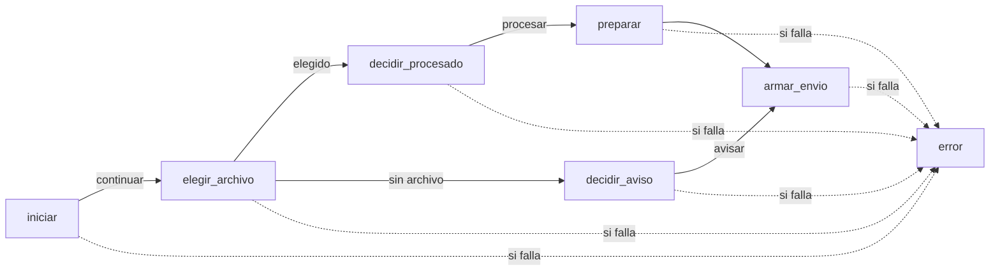

# Guía del código del núcleo

**Para quién:** quien vaya a leer o cambiar el código (tú, un programador que contrates o yo en otra sesión). Si lo que quieres es
entender qué hace el servicio, empieza por la [guía práctica](../../docs/04-guia-practica.md).
**Estado:** 2-oct-2026. La lista de cada módulo y cada función está en la [referencia](REFERENCIA.md), que se genera desde el código y
una prueba mantiene al día.

---

## 1. Por dónde empezar

| Orden | Qué leer | Para qué |
|---|---|---|
| 1 | [`../README.md`](../README.md) | Qué es el núcleo, qué garantiza y sus límites conocidos. |
| 2 | Esta guía | Las reglas del código, cómo viajan los datos y cómo cambiar algo sin romperlo. |
| 3 | [`../src/pipeline.js`](../src/pipeline.js) | El orden de un día de trabajo, en 326 líneas: es el plano del flujo de n8n. |
| 4 | [`REFERENCIA.md`](REFERENCIA.md) | Cada módulo, cada función pública, sus constantes y sus códigos de error. |
| 5 | [`../CODIGOS.md`](../CODIGOS.md) | Qué significa cada código de error y qué hacer. |
| 6 | [`../tests/`](../tests/) | Ejemplos que se ejecutan: cada regla tiene una prueba que la muestra. |

## 2. Cómo está organizado

```text
nucleo/
├── src/                el código que decide todo (11 archivos, unas 2.500 líneas; lo único que corre en n8n)
│   ├── util.js         base: fechas, importes en centavos, teléfonos, correos, escape de HTML, códigos de error
│   ├── m0 … m7         un módulo por tarea (guardias, normalizar, antigüedad, borradores, informe, envío, registro, ingesta)
│   ├── pipeline.js     el cableado: el orden de un día (variable global «Cobranza»)
│   └── envoltorio.js   la puerta del nodo de n8n: {op, entrada} → {ok, resultado} | {ok:false, codigo}
├── tests/              más de 450 pruebas (node --test), el simulador del flujo diario y el cargador que vigila la pureza
├── datos-ficticios/    generador de facturas inventadas en cuatro formatos y una configuración de ejemplo
├── demo/               informe y correo de demostración (se regeneran desde el código)
├── n8n/                generadores de los flujos de n8n, comparador con el servidor y escenarios de prueba (dist/ = lo que se sube)
├── doc/                esta guía y la referencia generada
├── mutaciones.js       pruebas de mutación: rompe el código a propósito y exige que alguna prueba lo note
├── CODIGOS.md          catálogo de códigos de error (una prueba lo compara con el código)
└── verificar.sh        verificación completa en segundos
```

## 3. Las reglas del código (y por qué)

| Regla | Cómo se ve | Por qué | Quién la vigila |
|---|---|---|---|
| **Funciones puras**: sin red, archivos, reloj, azar, consola ni variables de entorno | `M2.calcularAntiguedad(entrada)` recibe datos y devuelve datos | Lo que se prueba es exactamente lo que corre en n8n, y un módulo sin salida al exterior no puede filtrar datos | `tests/cargar.js` carga cada módulo en un entorno que **prohíbe** el reloj y el azar; `guardarrailes.test.js` |
| **Un módulo por archivo**, una variable global, que solo usa `Util` (el pipeline usa todos; el envoltorio, el pipeline) | `var M2 = (function () { 'use strict'; … return { … }; })();` | Cada módulo se puede leer, probar y pegar en un nodo de n8n por separado | `guardarrailes.test.js` |
| **JavaScript sencillo** (`var`, `function`) | Sin clases ni sintaxis moderna | Corre igual en el nodo de código de n8n y en cualquier Node, y se empaqueta sin herramientas ni dependencias | `node --check`, pruebas del paquete |
| **Errores con código, nunca con texto** | `Util.fallar('E_FACTURA_INVALIDA')` | Un mensaje de error podría llevar un nombre o un importe del cliente; un código no | `guardarrailes.test.js`: solo `Util.fallar` lanza, con un código del catálogo |
| **Dinero en centavos enteros, por moneda** | `importe_centavos`, `Util.sumarSeguro` | Sin errores de redondeo; pesos y dólares nunca se suman | `propiedades.test.js` con un oráculo independiente |
| **Fechas como texto `AAAA-MM-DD`**, cuentas en UTC | `Util.diasEntre(vencimiento, fecha_corte)` | El resultado no depende de la zona horaria del servidor | Toda la batería corre en seis zonas horarias |
| **Falla cerrada** | Cada función pública valida su entrada al principio | Ante la duda se aparta o se detiene y se avisa; nunca se adivina | Pruebas de cada módulo, fuzz y mutaciones |
| **Nombres en español** | Funciones en `camelCase` (`calcularAntiguedad`), datos en `snake_case` (`fecha_corte`), constantes en `MAYÚSCULAS` | Coherencia con la documentación y con quien lo opera | Convención (no hay un verificador automático) |
| **Sin dependencias externas** | Ni `package.json` ni `node_modules` | Nada que actualizar y ningún código ajeno dentro del servicio | — |

## 4. Cómo viajan los datos

El flujo de n8n no decide nada: lee y escribe, y en cada paso le pide al núcleo qué hacer. Lo pide con **siete operaciones**, siempre con
el mismo formato (`Envoltorio.operar(op, entrada)` → `{ ok: true, op, resultado }` o `{ ok: false, op, codigo }`; nunca lanza un error):

| # | Operación | Función | Qué decide |
|---|---|---|---|
| 1 | `iniciar` | `Cobranza.iniciar` | Fecha de corte local, interruptor general, configuración y bloqueo: seguir, detenerse u omitir. |
| 2 | `elegir_archivo` | `Cobranza.elegirArchivo` | Qué archivo de la carpeta se procesa (o que no hay, o que hay dos igual de recientes). |
| 3 | `decidir_aviso` | `Cobranza.decidirAviso` | Si no hay archivo: esperar, avisar al dueño o no repetir el aviso. |
| 4 | `decidir_procesado` | `Cobranza.decidirProcesado` | Que la descarga llegó entera y que ese archivo no se procesó ya. |
| 5 | `preparar` | `Cobranza.preparar` | Lee el archivo (M1), calcula la antigüedad (M2), redacta (M3) y arma el informe (M4), o una incidencia. |
| 6 | `armar_envio` | `Cobranza.armarEnvio` | El correo, a quién va (M5) y la fila del libro, validada **antes** de enviar. |
| 7 | `error` | `Cobranza.manejarError` | Si algo falló: aviso a Javier (solo códigos) y fila «error» del libro. |



**Los datos principales** (los campos completos, con sus reglas, están en la referencia de cada módulo):

| Dato | Campos | Lo produce |
|---|---|---|
| Factura normalizada | `factura_ref`, `deudor_nombre`, `moneda`, `importe_centavos`, `emision`, `vencimiento`, `contacto_tel`, `tel_movil`, `contacto_mail`, `en_disputa`, `fila_origen` | `M1.normalizarTabla` |
| Factura vencida | la anterior más `dias_atraso`, `tramo`, `escalon`, `nueva_esta_semana` | `M2.calcularAntiguedad` |
| Fila del libro | `clave`, `cliente_id`, `semana_iso`, `hash_archivo`, `estado`, `iniciada_utc`, `terminada_utc`, `n_filas`, `n_vencidas`, `n_apartadas`, `codigo_error`, `modo` (solo contadores: ni nombres ni importes) | `M6.filaLibro` |
| Configuración de un cliente | ejemplo completo en [`../datos-ficticios/config-ejemplo.js`](../datos-ficticios/config-ejemplo.js) | quien la escribe (tú) |

## 5. Recetas: cómo hacer los cambios más comunes

Regla general: **un cambio, luego `./verificar.sh`**. Si algo se rompe, la salida dice qué prueba y por qué.

| Quiero… | Qué tocar | Qué más | Cuánto cuesta |
|---|---|---|---|
| **Un cliente con otro formato de exportación** | Solo su configuración: `mapeo_columnas`, `formato_importe`, `zona_horaria`… No se toca código. | Probar con un archivo de ejemplo de ese formato. | Bajo |
| **Cambiar el texto de un recordatorio** | `PLANTILLAS_POR_DEFECTO` en `src/m3-borradores.js` (o plantillas propias en la configuración del cliente). | Las pruebas rechazan amenazas y palabras prohibidas (`PALABRAS_PROHIBIDAS`, `FRASES_PROHIBIDAS`). Regenerar la demostración: `node demo/generar-demo.js`. | Bajo |
| **Cambiar tramos o escalones** | La configuración del cliente (`tramos`, `escalones`) o los valores por defecto de `src/m2-antiguedad.js`. | `M2.validarTramos` y `M2.validarEscalones` rechazan combinaciones incoherentes. | Bajo |
| **Agregar un código de error** | `Util.fallar('E_NUEVO')` donde corresponda. | Una fila en `CODIGOS.md` (si falta, una prueba falla); si el dueño puede verlo, su texto en `DESCRIPCION_CODIGO` de `src/m4-informe.js`. | Bajo |
| **Agregar una moneda** | `Util` (`ETIQUETA_MONEDA`, símbolos), `MONEDAS` en M1, M2 y M4, y las etiquetas del informe. | Pruebas nuevas en `util`, `m1`, `m2` y `m4`. Es el cambio más disperso hoy (ver la sección 7). | Medio |
| **Cambiar el orden o un paso del día** | `src/pipeline.js` (y, si cambia la entrada o la salida, el flujo de n8n). | `pipeline.test.js` y los 40 escenarios de `e2e.test.js`. | Medio |
| **Cambiar el flujo de n8n** | `n8n/generar-shell.js`, luego `node n8n/generar-shell.js`. | `tests/n8n-flujos.test.js`; subirlo y comprobarlo con `node n8n/comparar-despliegue.js`. | Alto: requiere entender el generador |

**Después de cambiar cualquier cosa de `src/`:**
1. `./verificar.sh` (y, si tocaste una regla importante, `node mutaciones.js M2` para ese módulo, o `./verificar.sh --mutaciones` para todo).
2. `node n8n/generar.js`: regenera el paquete que corre en n8n. **El núcleo de tu servidor queda viejo hasta que se suba el paquete nuevo**
   (lo hago yo con tu OK) y se compruebe con el comparador.
3. `node doc/generar-referencia.js`: actualiza la referencia (si te olvidas, una prueba te lo recuerda).

## 6. Las pruebas

| Archivo | Qué cubre | Pruebas |
|---|---|---|
| `util.test.js`, `m0.test.js` … `m7.test.js` | Cada módulo por separado: casos normales, bordes y entradas hostiles | 25 + 22 + 35 + 18 + 21 + 17 + 25 + 53 + 26 |
| `pipeline.test.js` | El cableado: cada operación, sus contratos y sus errores | 77 |
| `e2e.test.js` | 40 escenarios del día completo con el simulador (`simulador.js`): repeticiones, caídas, correo caído, descarga cortada… | 40 |
| `propiedades.test.js` | Miles de archivos al azar contra un cálculo independiente (el «oráculo») | 8 |
| `guardarrailes.test.js` | Reglas sobre el texto del código: pureza, solo códigos, sin caracteres invisibles, sin credenciales, catálogo al día | 17 |
| `envoltorio.test.js`, `bundle.test.js` | La puerta de n8n y el paquete que de verdad se ejecuta | 23 + 7 |
| `n8n-flujos.test.js` | Los flujos de n8n generados: grafo, seguridad del banco de pruebas, reglas aprendidas contra n8n | 40 |
| `generador.test.js`, `demo.test.js`, `documentacion.test.js` | Datos ficticios, demostración y esta documentación al día | 8 + 6 + 4 |

Comandos útiles:

```bash
./verificar.sh                                         # todo, en seis zonas horarias (segundos)
node --test tests/m2.test.js                           # un archivo
node --test --test-name-pattern="tramos" tests/m2.test.js   # las pruebas cuyo nombre contiene «tramos»
node mutaciones.js M2                                  # las averías provocadas en M2 (cada una debe hacer fallar alguna prueba)
```

Para escribir una prueba nueva, el patrón es siempre el mismo: cargar el módulo con `cargar('util', 'm2-antiguedad')` desde `tests/cargar.js`,
llamar a la función con datos ficticios y comparar con lo esperado (`assert.deepEqual`). Si es un error, comprobar el **código**, no el mensaje.

## 7. Calidad: evaluación honesta (2-oct-2026)

**Lo que está bien, con evidencia:**
- 472 pruebas en seis zonas horarias, 140 mutaciones del núcleo (138 detectadas y 2 toleradas con su razón) y 19 de los generadores.
- Pureza **comprobada en cada ejecución**, no prometida. Sin dependencias externas.
- Un análisis con ESLint (reglas recomendadas) **no encontró defectos** en `src/`. Lo que marcó es de forma:
  - variables de `catch` sin usar;
  - barras escapadas de más en expresiones regulares;
  - un parámetro sin usar en `src/m4-informe.js`.
- El flujo de n8n se comparó contra el simulador en 54 pasos con resultado idéntico.

**Lo que se puede mejorar:**

| Punto | Detalle | Propuesta |
|---|---|---|
| Funciones largas o con muchas ramas | `M1.validarConfig` (complejidad 50), `M1.normalizarTabla` (142 líneas), `Cobranza.armarEnvio` (27), `M6.filaLibro` (26) y las de lectura de fechas, importes y teléfonos de `Util` | Partirlas en reglas más chicas. Las pruebas y las mutaciones protegen la reescritura. |
| Líneas largas | 196 líneas pasan de 120 caracteres y 34 de 160 | Un formateador automático con un ancho acordado. |
| 25 de 84 funciones públicas sin comentario propio | Listadas al principio de la [referencia](REFERENCIA.md) | Agregarlo en el próximo cambio de cada módulo. |
| Monedas definidas en varios lugares | `MONEDAS` en M1, M2 y M4; etiquetas en `Util` y M4 | Centralizarlas en `Util`. |
| Sin integración continua ni configuración del linter en el repositorio | Hoy las pruebas corren cuando alguien ejecuta `./verificar.sh` | Una acción de GitHub que corra la verificación en cada envío, más la configuración de ESLint. |
| El generador del flujo de n8n arma código como texto | `n8n/generar-shell.js`, unas 700 líneas | Es lo más difícil de modificar; está cubierto por 36 pruebas y 19 mutaciones. |
| Sintaxis antigua (`var`, IIFE) y nombres solo en español | Elección deliberada (ver la sección 3) | Si un día entra un equipo que no hable español, o se migra a TypeScript, se replantea. |

**Cuándo hacer estas mejoras.** Cualquier cambio en `src/`, aunque sea de forma, cambia el paquete que corre en n8n y obliga a subirlo de nuevo
(con su comprobación). Por eso conviene **agrupar** los arreglos de forma con el próximo cambio funcional de cada módulo, no hacerlos sueltos.
La integración continua, la configuración del linter y esta documentación no tocan `src/` y se pueden hacer en cualquier momento.
